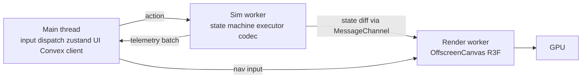
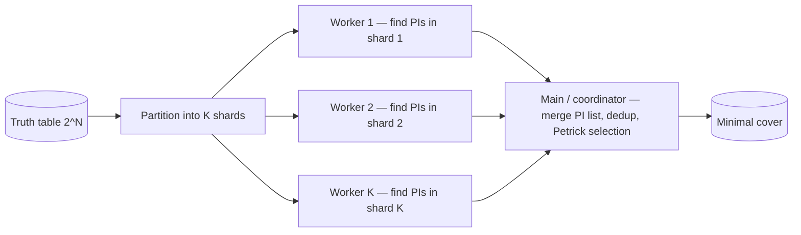
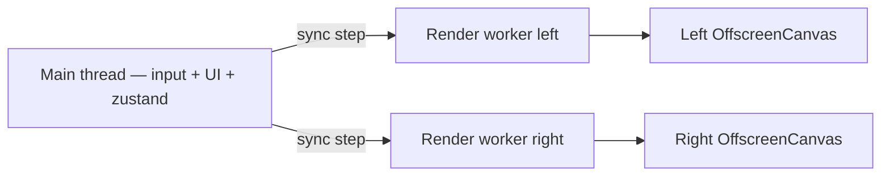

# CONCURRENCY

Maximum concurrency + parallelism contract. Every compute path that can run in parallel does. Every wait that can overlap with other work does.

## Worker pool

| Worker | Count | Spawn |
|---|---|---|
| Sim worker (state machine + executor) | 1 | App boot (pre-warm) |
| Render worker (OffscreenCanvas) | 1 per active 3D scene (compare mode = 2) | App boot |
| Solver worker (QM / Petrick / Espresso) | `min(navigator.hardwareConcurrency - 1, 4)` with floor 2 | App boot (pre-warm) |
| Pipeline analyzer worker pool | `min(navigator.hardwareConcurrency / 2, 2)` with floor 1 | App boot (pre-warm) |
| Geometry generator worker | 1 | App boot (pre-warm) |
| Assembler worker | 1 | App boot (pre-warm); handles all programs not just >100-line |
| Shared worker (cross-tab compute reuse) | 1 per origin | First tab opens it |

## Three-worker pipeline

Main thread is pure input dispatcher + zustand UI state. All compute + render off main:



Sim worker maintains `MachineState` (registers, memory, PC). Receives action (`step`, `run`, `reset`, `loadProgram`); emits new state. State diffs flow to Render worker via `MessageChannel` (no main-thread relay).

Render worker maintains scene graph. Receives state diff; updates mesh positions, materials, emissive intensities; renders frame. Sends pointer-hit results back to Main.

Main thread receives input, dispatches to Sim/Render via Comlink. Updates zustand for UI chrome. Handles Convex subscriptions.

## Worker-to-worker MessageChannel

Direct port between workers, established once at boot:

```ts
// Main creates port pair
const { port1, port2 } = new MessageChannel();
simWorker.postMessage({ kind: 'connect-render' }, [port1]);
renderWorker.postMessage({ kind: 'connect-sim' }, [port2]);
// After this, simWorker ↔ renderWorker communicate directly; main thread free.
```

Cuts inter-worker latency from ~2ms (main-thread relay) to <0.5ms (direct).

## Concurrent shader compilation

Three.js r155+ `Material.compileAsync(scene, camera)` enables non-blocking shader compile. Render worker queues all material compilations on scene mount; browser parallelizes across cores; render starts when first material ready.

```ts
const materials = scene.getMaterials();
await Promise.all(materials.map((m) => renderer.compileAsync(m, camera)));
```

Combined with AOT shader cache from previous session (persisted via OPFS), repeat visits see zero shader compile cost.

## Concurrent procedural geometry generation

Heavy procedural geometry (datapath substrate, K-map toroidal surface, signal-pulse curve geometries) generated in Geometry worker. Transferred to Render worker via Transferable `Float32Array` (`vertices`, `normals`, `uvs`) and `Uint32Array` (`indices`).

Main thread never touches geometry buffers; transfer is zero-copy.

## Parallel pipeline hazard analysis

Long programs (>50 instructions) shard hazard detection across Pipeline Analyzer Worker pool. Each worker analyzes a window of N instructions. Coordinator merges results for cross-window hazards (RAW spanning a window boundary).

For shorter programs, single-worker pipeline analyzer handles end-to-end.

## Parallel snapshot decode (`/me` page)

Bulk load of N saved snapshots:

```ts
const decodedStates = await Promise.all(
  snapshotHashes.map((hash) => decodeWorkerPool.acquire().decode(hash)),
);
```

Solver worker pool repurposed for snapshot decode (codec is similar shape, workers idle when no solve in flight).

## Concurrent zstd encoding for large snapshots

For snapshot canonical bytes > 16KB, zstd encoding uses worker pool. Each worker compresses a chunk; concatenated. zstd supports parallel mode out-of-box.

Small snapshots stay single-worker (parallel overhead exceeds savings under threshold).

## Speculation triple-buffering during scrub

Sustained timeline scrub triggers speculative pre-compute:
1. Frame N rendered now (current cursor)
2. Sim worker pre-computes frames N+1, N+2, N+3 in scrub direction during render idle gap
3. Pre-computed frames cached in zustand transient
4. User pointer moves to N+2 → instant render (no compute wait)

Reverse on direction change. Cancelable via AbortSignal if scrub ends.

## OPFS for solver result cache

Solver results cached via Origin Private File System — async file I/O off main thread, larger budget than localStorage (~hundreds of MB).

```ts
const root = await navigator.storage.getDirectory();
const handle = await root.getFileHandle(`qm-${hash}.json`, { create: true });
const writable = await handle.createWritable();
await writable.write(JSON.stringify(result));
await writable.close();
```

Browser handles OPFS I/O async + concurrent. Cross-tab cache hit via SharedWorker reading same OPFS path.

## WebGPU command encoder parallelism (when WebGPU primary)

WebGPU `GPUDevice.createCommandEncoder()` allows multiple concurrent encoders. Render worker submits parallel command buffers (datapath scene + HUD overlay + critical-path highlight as separate encoders). GPU queue handles ordering.

WebGL fallback path serializes by API design; WebGPU is the parallel gain.

All workers pre-warmed at app boot per `PERFORMANCE.md` "Pre-warmed Worker pool" rule.

## Parallel solver via truth-table partitioning

QM (and Espresso) for ≥ 5-variable functions shard the truth-table across N solver workers:



Coordinator runs Petrick selection (the merge step) on the main solver worker — partition is the parallelizable phase, selection is dependency-heavy and stays serial. Net speedup ≈ K for the partition phase, total speedup ≈ 0.7 × K accounting for serial selection.

## Per-scene render worker in compare mode

Compare mode mounts 2 scenes side-by-side. Each gets its own `OffscreenCanvas` + dedicated render worker. Both workers receive sync step messages but render independently.



CPU cost is ~2× single scene, but parallel — wall-clock matches single scene on multi-core devices.

## Parallel Convex query discipline

Independent queries always parallel:

```ts
// good
const [snapshots, profile, examples] = await Promise.all([
  convex.query(api.snapshots.mySnapshots),
  convex.query(api.users.profile),
  convex.query(api.examples.list),
]);

// banned — sequential await for independent reads
const snapshots = await convex.query(api.snapshots.mySnapshots);  // 🚫
const profile = await convex.query(api.users.profile);
```

Lint asserts: multiple `await convex.query(...)` in the same function body without intermediate dependency = violation; replace with `Promise.all`.

## Concurrent Server Actions

Same pattern for client-initiated Server Action chains where actions don't depend on each other:

```ts
const [savedKmap, fetchedExamples] = await Promise.all([
  saveKmapAction(state),
  loadExamplesAction(),
]);
```

## Selective hydration priority

React 19 supports priority-shaped hydration. Visible content hydrates first:

```tsx
<Suspense fallback={<SkeletonHero />}>
  <HeroAboveFold />  {/* hydrates first */}
</Suspense>
<Suspense fallback={null}>
  <SidebarBelowFold />  {/* hydrates after visible-priority items */}
</Suspense>
```

Hydration priority signaled via Suspense boundary placement + `<link rel="modulepreload" fetchpriority="high">` on critical bundles.

## Streaming hash for large snapshots

`blake3` supports incremental hashing — chunks fed as stream arrives. For snapshot bodies > 64 KB:

```ts
const hasher = blake3.create();
for await (const chunk of stream) {
  hasher.update(chunk);
  // chunk also feeds incremental zstd decompress in parallel
}
const hash = hasher.digest();
```

Hash compute overlaps with stream arrival; net wall-clock = stream latency only.

## Cross-tab coordination

| Mechanism | Use |
|---|---|
| `BroadcastChannel('sim')` | Signin event propagates to all tabs; save event propagates so other tabs invalidate their localStorage anon-hash list |
| `SharedWorker` (where supported) | Single QM solver result shared across tabs (cache hit even if tab A solved, tab B requests same hash) |
| `navigator.locks.request('save', ...)` | Web Locks API — prevent two tabs from simultaneously saving identical state (content-addressed dedups anyway, but lock saves the redundant write) |
| `localStorage` event | Fallback for browsers without BroadcastChannel (mostly redundant; covered by BroadcastChannel polyfill) |

## GPU / CPU pipelining

CPU prepares next-frame transform matrices + animation interpolation while GPU renders current frame:

```ts
useFrame((state) => {
  // CPU work: update next-frame state
  prepareNextFrame(state);
  // GPU autoflows — render call submitted, returns immediately
  // Browser pipelines: while GPU draws, CPU is free for next frame's prep
});
```

drei `PerformanceMonitor` ensures GPU saturation doesn't tank CPU-side budget.

## Build graph parallelism

Turbo's task graph determines parallel execution. Discipline: every package's `dependsOn` array names only TRUE dependencies. Spurious dependencies serialize parallel work.

```jsonc
// good — package A only waits on real deps
{ "pipeline": { "build": { "dependsOn": ["^build"] } } }

// banned — overly broad dependsOn that forces unnecessary serialization
```

Turbo's `tasks` should show maximum parallelism for `bun run build` on a multi-core machine. CI verifies build graph fans out wide.

## Test parallelism

- Bun test: parallel by default, per-file isolation
- Per-package tests run in parallel via Turbo
- E2E (Playwright): parallel workers, shared browser instance with isolated contexts
- Convex integration tests: per-test isolated Convex in-memory backend

## CI parallelism (post velocity-mode exit)

GitHub Actions matrix:
- Lint + typecheck: one job per workspace, parallel
- Unit tests: one job per package, parallel
- E2E tests: sharded across N runners
- Lighthouse-CI: per-route parallel
- Mutation tests: per-package parallel
- Visual regression: per-fixture parallel

Total wall-clock = slowest single job, not sum.

## Speculative pre-compute on idle

`requestIdleCallback` fires for non-critical compute. Patterns:
- Pre-compute next N frames during scrub direction (per `PERFORMANCE.md` predictive input)
- Pre-warm next-likely route's data via Convex queries while user reads current
- Pre-index search corpus updates after content change
- Pre-validate next likely user input (e.g., next instruction in a curriculum sequence)

Idle work cancellable via `AbortSignal` if user navigation / interaction supersedes.

## Concurrent telemetry flush

`/api/rum` accepts batched events; client buffers + flushes on `requestIdleCallback` or `visibilitychange` (whichever fires first). Never blocks input or render.

`navigator.sendBeacon` for unload-time flush so events ship even on tab close.

## Concurrent file I/O on server

Server Actions + Route Handlers always `Promise.all` for independent fs / Convex / network ops.

## Deferred-with-trigger ratchets

| Ratchet | Trigger |
|---|---|
| Workerized Convex client (subscriptions in dedicated worker) | Main-thread cost of Convex subscription dispatch measurably exceeds 1ms p95 |
| SharedArrayBuffer + Atomics for lock-free cross-worker state | COOP/COEP commitment per `adr/compute-budgets.md` SAB trigger |
| WebGPU compute shaders for QM/Espresso solver | Solver workload exceeds CPU-worker partition budget |
| Multi-region anycast for read latency | Single-region origin hits user-latency ceiling |

## Anti-patterns banned

- Sequential `await` on independent operations (use `Promise.all`)
- Sync work blocking hydration (always Suspense-bounded)
- Single worker handling work that could shard
- Forgetting to pass `AbortSignal` to async ops in idle callbacks
- Cross-tab state drift (BroadcastChannel + localStorage event)
- `setTimeout` for delay between work units (use `scheduler.yield()` + priority)
- Saving without `navigator.locks.request` when concurrent tabs likely
- Spurious `dependsOn` in turbo config serializing parallel work
- Sim state machine on main thread (must run in Sim worker)
- Inter-worker messages relayed through main thread (use MessageChannel direct port)
- Synchronous shader compile (use `compileAsync`)
- Procedural geometry generated on main thread (use Geometry worker + Transferable)
- Bulk snapshot decode sequentially (parallelize via worker pool)
- localStorage for solver result cache > 5MB (use OPFS)
- Single command encoder on WebGPU when scene composes multiple independent passes (use parallel encoders)

## Caught by

- `tools/lint/promise-all-discipline.ts` — sequential `await` on independent operations flagged
- `tools/lint/worker-pool-sizing.ts` — workers spawned with correct count formula
- `tools/lint/abort-signal-coverage.ts` — every async exported fn declares `signal?: AbortSignal`
- Turbo `--graph` output verified maximum parallelism
- CI total wall-clock budget per stage
- BroadcastChannel smoke — open 2 tabs, save in one, verify other reflects
- SharedWorker smoke — QM result cache hit cross-tab
- Compare mode smoke — 2 render workers spawned, both meet frame budget
- Parallel solver smoke — 6-var QM completes within budget on K-worker partition
- Three-worker pipeline smoke — sim worker step → render worker frame round-trip < 5ms
- MessageChannel direct-port smoke — inter-worker latency < 0.5ms p95
- `compileAsync` smoke — material list compiles in parallel, render starts on first-ready
- Geometry worker transferable smoke — `Float32Array` ownership transfers zero-copy
- Pipeline parallelism smoke — 100-instruction program shards across K workers within budget
- Bulk snapshot decode smoke — 50 snapshots decoded in parallel within budget
- OPFS cache hit smoke — solver re-run with same input returns cached result
- WebGPU parallel encoder smoke — multi-pass scene submits without sequential lock
