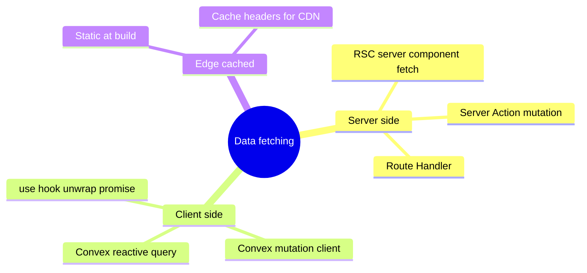

# DATA-FETCHING

Decision matrix for every server-touching component.

## Fetch primitives



## Decision matrix

| Need | Primitive | Why |
|---|---|---|
| Initial page render data | RSC | Streams from server, smallest client bundle, SEO-friendly |
| Real-time updates (saved-snapshots list when user opens `/me`) | Convex reactive query | Live updates as data changes |
| One-shot write (saveSnapshot, claimAnonSnapshots, flagAbuse) | Server Action | Co-located with form, typed, progressive enhancement |
| Heavy computation (Quine-McCluskey for 6-var) | Server Action with `'use cache'` | Cache by input hash, offload from client |
| Build-time content (learn pages, examples) | RSC + static generation | Zero runtime cost |
| Snapshot load (`/s/[hash]`) | RSC + Cloudflare edge cache | Content-addressed = forever-cacheable |
| OG card | Route Handler with `ImageResponse` | Dynamic per hash, edge-cacheable |
| Web Vitals reporting | Route Handler `/api/rum` | Aggregate-only, fire-and-forget |
| Health check | Route Handler `/api/healthz` | Per `adr/health-check.md` |
| Search index (command palette) | Build-time JSON + client lazy load | Static, ~50 KB, fuzzy-search-able |
| Sitemap | Route Handler `/sitemap.xml` | Dynamic from MDX content discovery |

## RSC pattern

```tsx
// app/datapath/page.tsx (RSC)
export default async function DatapathPage({ searchParams }) {
  const examples = await loadExampleManifest(); // FS read at build
  return (
    <Layout>
      <DatapathClient examples={examples} />  {/* hydrates with prop */}
    </Layout>
  );
}
```

## Server Action pattern

```ts
// app/datapath/actions.ts
'use server';

export async function saveSnapshotAction(state: SnapshotInput) {
  const parsed = SnapshotSchema.parse(state); // Zod validate
  const bytes = canonicalize(parsed);
  if (bytes.length <= 1024) return { ok: true, urlFragment: encodeFragment(bytes) };
  const hash = await convex.mutation(api.snapshots.saveSnapshot, { hash: blake3(bytes), bytes });
  return { ok: true, hash };
}
```

Consumer:
```tsx
const [state, action, pending] = useActionState(saveSnapshotAction, null);
```

## Convex reactive query pattern

```tsx
// /me page (signed-in)
const snapshots = useQuery(api.snapshots.mySnapshots, { cursor: null });
// re-renders automatically as new saves land
```

## Route Handler pattern

```ts
// app/s/[hash]/route.ts
export async function GET(_: Request, { params }: { params: { hash: string } }) {
  const snapshot = await convex.query(api.snapshots.loadSnapshot, { hash: params.hash });
  if (!snapshot) return new Response('not found', { status: 404 });
  if (snapshot.abuseFlag) return new Response('gone', { status: 410 });
  return Response.json(snapshot, {
    headers: { 'cache-control': 'public, immutable, max-age=31536000, s-maxage=31536000' },
  });
}
```

## Cache strategy

| Surface | Cache layer |
|---|---|
| Static routes (landing, learn) | CF edge + Next ISR-equivalent |
| `/s/[hash]` | CF edge forever-cached (content-addressed) |
| `/api/og/*` | CF edge forever-cached per hash |
| `/api/healthz` | `no-store` |
| `/me` page | `no-store`, signed-in only |
| Convex reactive queries | Convex internal cache + client subscription |
| Server Action results | `'use cache'` directive with content hash as key when applicable |

## Banned

- `fetch()` calls in client components for in-app data (use Convex client)
- Client-side data fetching libraries (TanStack Query, SWR) — Convex client already provides reactive cache
- Server-side fetch loops without `AbortSignal.timeout(ms)` per `book/HARD-RULES.md` "Every wait loop has a deadline"
- Cross-route data prop drilling (use route segment loaders or context)
- N+1 query patterns (batch via Convex `Promise.all` or denormalize)

## Optimistic updates

`useOptimistic` from React 19 for any user-initiated mutation:

```tsx
const [optimistic, addOptimistic] = useOptimistic(snapshots, (curr, newOne) => [...curr, newOne]);
```

Used on save (preview appears instantly, server confirms async).

## Suspense boundaries

Every data fetch is wrapped in Suspense at the appropriate level:
- Page-level boundary for initial data
- Component-level boundary for incremental data
- Streaming SSR enabled per route

## Caught by

- `tools/lint/no-client-fetch.ts` greps client components for raw `fetch()` (allows only Convex / Server Action consumption)
- Smoke: each surface returns expected cache headers
- E2E: optimistic updates roll back on server error
- Performance test: Suspense boundaries serve initial paint within `LCP` budget
