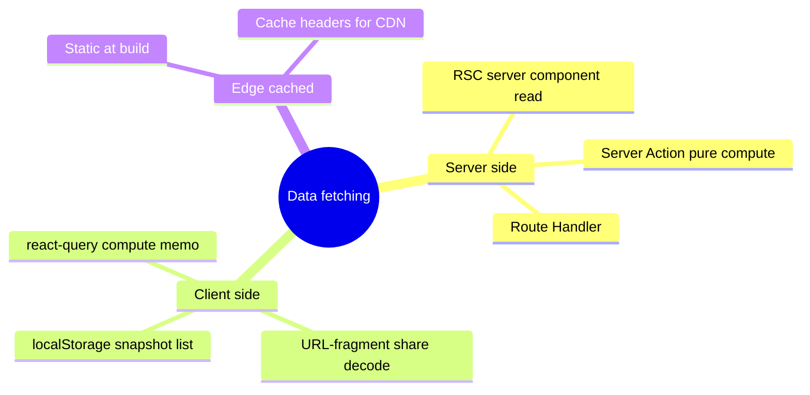

# DATA-FETCHING

Decision matrix for every data-touching component. Pure-client app — no backend, no server-side persistence; data is static, computed, or read from the visitor's browser.

## Fetch primitives



## Decision matrix

| Need | Primitive | Why |
|---|---|---|
| Initial page render data | RSC | Streams from server, smallest client bundle, SEO-friendly |
| Local snapshot list (`/me`) | Client `localStorage` read | Snapshots live in the visitor's own browser |
| Heavy computation (Quine-McCluskey for 6-var) | Server Action with `'use cache'` | Cache by input hash, offload from client |
| Client compute memoization | `@tanstack/react-query` | Cache pure assemble/solve results by input hash in the client |
| Build-time content (learn pages, examples) | RSC + static generation | Zero runtime cost |
| Shared snapshot load (`/s/[hash]`) | Client URL-fragment decode | Whole state rides in the URL fragment, no network |
| OG card | Route Handler with `ImageResponse` | Dynamic per hash, edge-cacheable |
| Web Vitals reporting | Route Handler `/api/rum` | Cookieless aggregate, fire-and-forget |
| Health check | Route Handler `/api/healthz` | Per `adr/health-check.md` |
| Search index (command palette) | Build-time JSON + client lazy load | Static, ~50 KB, fuzzy-search-able |
| Sitemap | Route Handler `/sitemap.xml` | Dynamic from MDX content discovery |

## RSC pattern

```tsx
// app/datapath/page.tsx (RSC)
export default async function DatapathPage({ searchParams }) {
  const examples = await loadExampleManifest(); // FS read at build
  return (
    <Layout>
      <DatapathClient examples={examples} />  {/* hydrates with prop */}
    </Layout>
  );
}
```

## Server Action pattern (pure compute)

```ts
// app/kmap/actions.ts
'use server';

export async function solveAction(input: TruthTableInput) {
  const parsed = TruthTableSchema.parse(input); // Zod validate
  return quineMcCluskey(parsed); // pure, 'use cache' keyed on input hash
}
```

Consumer:
```tsx
const [state, action, pending] = useActionState(solveAction, null);
```

## Local snapshot pattern

```tsx
// /me page — client component
const snapshots = useLocalSnapshots(); // reads localStorage, reactive to storage events
```

## Share decode pattern

```ts
// app/s/[hash]/share.ts — client
export function decodeShare(fragment: string): SimState {
  const bytes = base64urlDecode(fragment);
  return deserialize(inflate(bytes)); // DecompressionStream, fully client-side
}
```

States too large for a URL fragment are tier `'oversize'` — the encoder returns no link.

## Cache strategy

| Surface | Cache layer |
|---|---|
| Static routes (landing, learn) | CF edge + Next ISR-equivalent |
| `/api/og/*` | CF edge forever-cached per hash |
| `/api/healthz` | `no-store` |
| `/me` page | client-rendered from `localStorage` |
| Server Action compute results | `'use cache'` directive with content hash as key |
| Client compute results | `@tanstack/react-query` cache, content hash as key |

## Banned

- `fetch()` calls in client components for in-app data — there is no backend to fetch from
- Server-side fetch loops without `AbortSignal.timeout(ms)` per `book/HARD-RULES.md` "Every wait loop has a deadline"
- Cross-route data prop drilling (use route segment loaders or context)
- Any server-side persistence of visitor state

## Optimistic updates

`useOptimistic` from React 19 for any user-initiated local action:

```tsx
const [optimistic, addOptimistic] = useOptimistic(snapshots, (curr, newOne) => [...curr, newOne]);
```

Used on local save (preview appears instantly).

## Suspense boundaries

Every data read is wrapped in Suspense at the appropriate level:
- Page-level boundary for initial data
- Component-level boundary for incremental data
- Streaming SSR enabled per route

## Caught by

- `tools/lint/no-client-fetch.ts` greps client components for raw `fetch()` of in-app data
- Smoke: each surface returns expected cache headers
- E2E: optimistic updates roll back on Server Action error
- Performance test: Suspense boundaries serve initial paint within `LCP` budget
