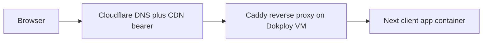

# DEPLOY

Dokploy VM (operator's existing infra) + Cloudflare DNS/CDN bearer. The app is a static/standalone Next client served behind Caddy — no backend services.

Decision + rationale: see `adr/deploy-target.md`.

## Topology



The browser does all the work: simulation, snapshot save to localStorage, and share encode/decode in the URL fragment. The origin only serves the static client.

## Compose locally

`compose.yaml` at repo root brings up the client behind Caddy:

```yaml
services:
  next-app:
    build: ./apps/web
    environment:
      - SITE_URL
      - PLAUSIBLE_DOMAIN
  caddy:
    image: caddy:latest
    volumes:
      - ./Caddyfile:/etc/caddy/Caddyfile
      - caddy-data:/data
    ports:
      - "80:80"
      - "443:443"
volumes:
  caddy-data:
```

`SITE_URL` and `PLAUSIBLE_DOMAIN` are public, non-secret build inputs.

## Deploy to Dokploy

```bash
make deploy
```

Equivalent to: build container image → push to registry → dokploy applies compose update → smoke check against deployed URL.

Concrete dokploy CLI invocation matches the operator's reference deploy project pattern (path in agent memory); project ID + dokploy server URL live in operator-local secrets.

## DNS + CDN

Cloudflare:
- A / AAAA records → Dokploy VM IP
- Proxied (orange cloud) → CDN cache active
- Page Rules: static asset paths cache-everything, immutable, edge-TTL 1y
- Always Use HTTPS on
- HSTS on
- No Workers, no KV, no D1, no Pages Functions, no R2 Worker bindings (per `adr/deploy-target.md` bearer-mode rules)

## Service worker + PWA

Per `adr/offline-pwa.md`. Next-pwa or Workbox registers a service worker at first visit. Caches app shell + assets. Because all state lives client-side and shares are URL-fragment-only, a visited share link works fully offline once the shell is cached. Service worker version-tagged at build; new build deploys → subtle update-available toast on next visit.

## Verifier targets

| Target | Asserts |
|---|---|
| `make verify.local` | Compose stack green, no internet access, full functionality (sim, save, share round-trip all client-side) |
| `make verify.bearer` | With CF in front of VM, identical responses + cache headers correct |
| `make verify.fresh` | Bootstrap from clean state + secrets dump, full system green |
| `make smoke` | Deployed URL serves landing + sim routes + share-link round-trip |

## Migration

| From → To | Cost |
|---|---|
| Dokploy VM → other VM | New dokploy deploy, re-point DNS. Minutes — the app is stateless on the server. |
| Dokploy → K8s cluster | Compose → Helm chart parity already maintained. Apply Helm, re-point DNS. Minutes. |
| Cloudflare → other CDN | Re-point DNS. Cache rebuilds from origin. Minutes. |

## Caught by

- `make verify.fresh` periodic ratchet
- Deploy smoke test against deployed URL
- Cloudflare bearer-feature lint asserts no Worker imports
- DNS check (`dig +short`) against expected records as part of post-deploy verification
