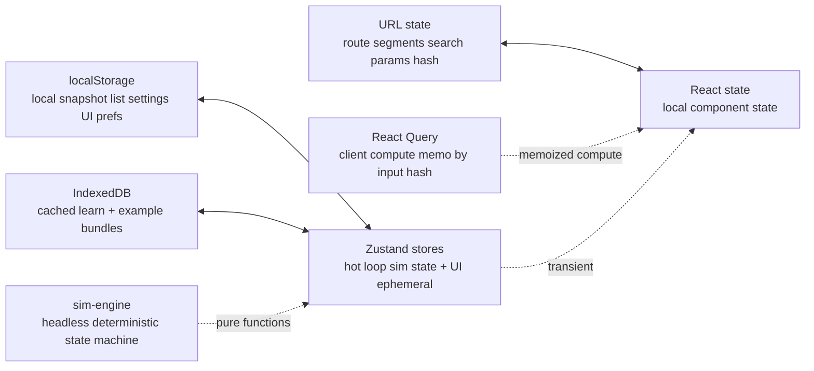

# STATE-MANAGEMENT

Boundaries between state layers. Each piece of state lives in exactly one layer per `book/HARD-RULES.md` "Every fact one home".

## Layers

## Per-layer ownership

### URL state

Owns:
- Current route (`/datapath`, `/kmap`, etc.)
- Selected instruction (`?instr=add`)
- Current step (`?step=EX`)
- Shared sim state (`/s#<fragment>` — the whole state encoded in the fragment)
- View mode (`?view=survey | study | compare`)
- Camera bookmark (`?cam=alu-closeup`)

Read via: Next router + `useSearchParams`
Write via: Router push / replace

Shareable state belongs here. Anything that should round-trip via a self-contained link lives in the URL fragment. States too large for a fragment are tier `'oversize'` — non-shareable by design.

### localStorage

Owns:
- Local snapshot list (the visitor's saved sims, surfaced at `/me`)
- Theme palette variant (if alternates landed)
- Reduced-motion override (operator-set, overrides browser)
- Onboarding-dismissed flag
- Editor preferences (font size, key bindings if user-configurable)

Read via: `useLocalStorage` hook
Write via: same

Per-device storage; nothing leaves the visitor's browser.

### React Query

Owns:
- Memoized results of pure client-side compute (assemble, solve) keyed on input hash

Read/write via: `@tanstack/react-query` cache. Same input → cache hit, zero recompute.

**Zustand `persist` + RSC**: `skipHydration: true` mandatory; otherwise first paint diverges. Server renders defaults; client rehydrates in `useEffect`. `partialize` strictly allowlist (never denylist) so sim-slice keys never leak into localStorage.

### IndexedDB

Owns:
- Cached learn page bundles (per `adr/offline-pwa.md`)
- Cached example bundles

Read/write via: idb-keyval or Workbox-managed cache

### Zustand (transient + ephemeral UI)

Owns:
- Current sim engine state (mutable, hot-loop, frame-by-frame)
- Current animation state (playing / paused / step index)
- Current selected K-map groupings (in-progress)
- Modal / dialog open state
- Toast queue
- Command palette open state + query

Read via: `useStore(selector)` with shallow comparison
Write via: store actions (typed)

Use `subscribeWithSelector` for transient subscriptions outside React render (per `PERFORMANCE.md` patterns).

### React state

Owns:
- Local form input drafts (before submit)
- Hover / focus states for individual components
- One-off ephemeral UI state not worth zustand

Default fallback when none of the above layers fit.

### sim-engine (headless)

Owns nothing persistent. Pure functions over state passed in. State is held by zustand; sim-engine produces next state per step. Per `DETERMINISM.md`.

### Optimistic local updates

Use React 19 `useOptimistic` for user-initiated local actions (e.g. local save preview appears instantly). No server round-trip to reconcile.

## Decision matrix

| Question | Layer |
|---|---|
| Should this round-trip via a self-contained link? | URL fragment |
| Should this persist on this device? | localStorage |
| Is this a cached result of pure compute? | React Query |
| Is this mutating frame-by-frame? | Zustand transient |
| Is this scoped to one component only? | React state |
| Is this a pure transformation of inputs? | sim-engine (no state) |

## Anti-patterns banned

- Persisting frame-loop state to localStorage (would thrash storage)
- Storing URL-derivable state in zustand (duplication, drift)
- React state for cross-component state (lift to zustand)
- Local-only state for share-worthy state (would lose on share — share-worthy state lives in the URL fragment)

## Hydration

RSC initial render reads URL + cookies. Client hydrates with that state + reads localStorage / IndexedDB after mount. No flash of unstyled content; reduced-motion / palette decisions made server-side via cookie hints.

## Caught by

- `tools/lint/state-layer.ts` greps `apps/web` for cross-layer-violation patterns (e.g., localStorage writes in a server component)
- E2E test: navigation preserves URL state but resets Zustand transient state
- Smoke: refresh page → URL state survives, localStorage state survives, zustand state resets to initial
