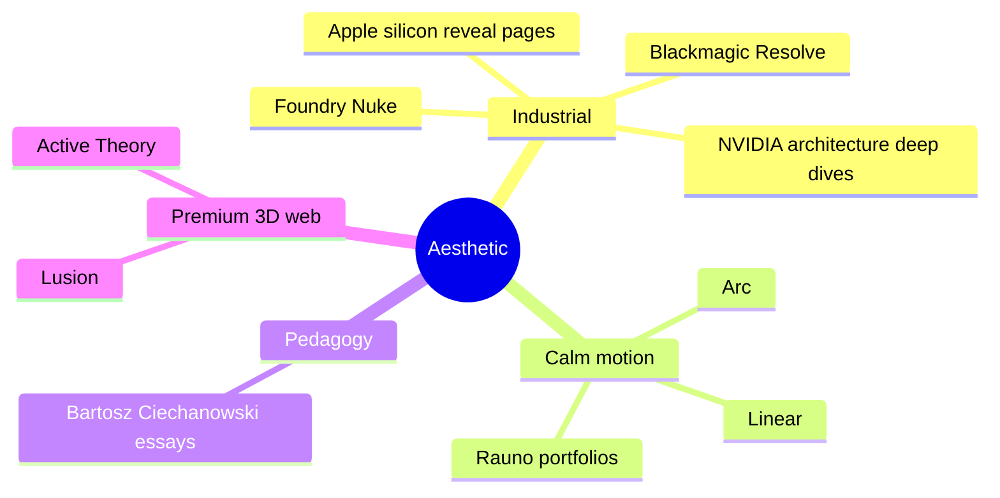

# UX-DOCTRINE

Visual + interaction rules. Pedagogy = product. Motion informative. Aesthetic industrial silicon, never gamified, never childish.

## Reference vibe

Banned: game UI, neon rainbow, comic-sans-adjacent, fun edutech, gamification badges, achievement toasts, mascots.

## Palette

- Near-black bg, single tone, no gradient
- Warm off-white primary text
- Cool gray tertiary text
- Single accent cyan-leaning for active signal
- Single amber for hazards/breakpoints/errors
- Max 5 named hues across product

Material palette (3D):
- Silicon die: machined-aluminum PBR, brushed normal, baked AO
- Buses: emissive trace, signal-pulse compatible
- Glass: drei MeshTransmissionMaterial low chromatic ab
- PCB: FR4-color, micro normal map
- Active glow: accent emissive when live, inert otherwise

## Typography

- Mono: JetBrains/Berkeley Mono, weights 400/500/700
- Tabular nums on every reg value, counter, signal
- Display: variable mono or proportional grotesque at large sizes
- Scale: 12/14/16/20/28/40/64, no in-between
- Tight line-height on data, generous on prose

## Motion

- Every transition encodes state change
- Default easing `cubic-bezier(0.2, 0.8, 0.2, 1)` smoothOut
- Spring physics on interactive elements
- Reduced-motion → instant snaps, info preserved
- Stage transitions: DoF focus pulls, 400-600ms
- Signal pulses: physically plausible falloff, never instant all-on
- Camera: dolly + cut. No spin, no roller-coaster, no "we did 3D" rotation

Concrete timings in `MOTION-CATALOGUE.md`.

## Camera grammar

Bookmarked views per scene: whole-datapath / ALU close / reg file iso / control unit / memory / pipeline side.

Dolly between bookmarks ~800ms easing. Free orbit available but tertiary. Keys 1-9 jump. Mouse drag = orbit, scroll = dolly, right-drag = pan.

## Depth + lighting

One key directional + HDRI environment for PBR. Contact shadows. Restrained bloom. Layered DoF focus pulls. SSAO via postprocessing.

## Diegetic readouts

Values etched on silicon, not floating:
- Register file: names + values on face
- ALU: result + zero flag on surface
- Control unit: signal plates with light
- Memory: address + word physical grid

Tooltips tertiary. Surface labels primary.

## In-3D vs DOM HUD

- In-3D (`packages/hud`, uikit): floats with scene, follows camera, sharper than `Html`. Signal annotations, breakpoint pins.
- DOM: editor, register table, memory table, control table, K-map cell input, asm output. Dense text-heavy.

Both share design tokens.

## Keyboard-first

Every action keyboard-invocable. Mouse acceleration not requirement. Full matrix in `A11Y.md`.

## Layout density modes

- **Survey**: 3D fills viewport, HUDs collapsed to edge dock
- **Study**: 3D + register/memory/control panels visible
- **Compare**: split-pane, synchronized scenes

Default Study. Keyboard toggle.

## Sound

None. Silent product. No clicks, no chimes. Visual feedback sufficient.

## Loading + Suspense

- Initial scene load: drei `Loader`, subtle progress, no "loading..." copy
- Per-route streaming Suspense w/ skeleton geometry → full detail morph
- Asset preload hints from RSC (three-kit `preload()` helpers)

## Empty / error states

- Empty: one-line domain prompt. No illustration. No "Let's get started!"
- Error: failure quoted exact, offending input shown, next action implied. No apology.

## Accessibility

Per `A11Y.md`. WCAG AA contrast. Full keyboard nav. Reduced-motion respected. Visible focus rings (custom, not removed). Screen-reader proxies on every interactive 3D element. Color never sole carrier of meaning.

## Anti-patterns banned

- Emojis in product copy
- Achievement / streak / progress surfaces
- Onboarding tutorials w/ forced step-through (single inline hint OK, dismissible, never returns)
- Confetti / celebration animations
- Pro-tip callouts
- Sticky bottom CTA bars
- Modals for non-irreversible actions
- Loading copy beyond skeleton
- Auto-rotating 3D when idle
