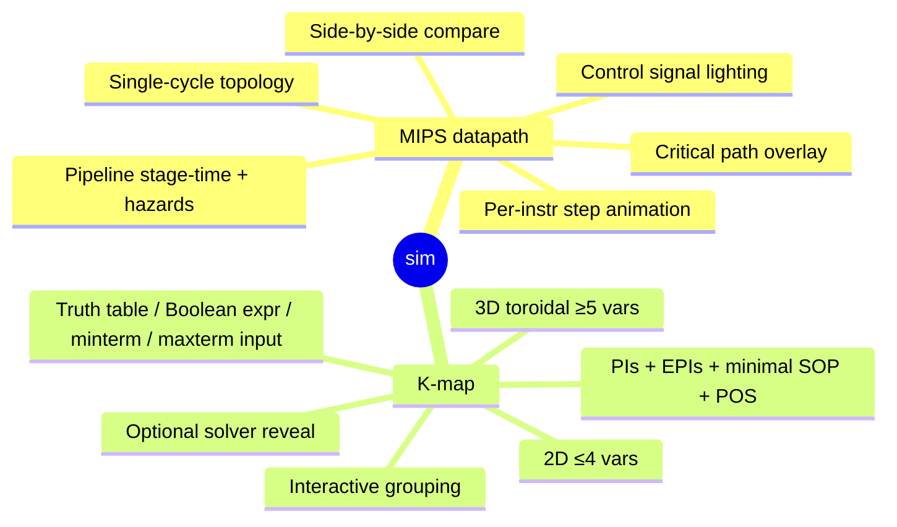

# VISION

3D viz for low-level digital logic + computer architecture. Floor today: MIPS datapath + K-map. Both world-class, both better than every 2D equivalent.

Substrate carries every primitive. Each sim = thin product delta. Substrate grows; product shrinks.

## Why 3D earns place

- Datapath: physical depth → stages/regs/ALU/mem/control = machined silicon w/ emissive traces. Camera moves between high-level and stage close-up. Signal propagation = physically plausible light along buses.
- K-map ≥5 vars: 2D split-map kills wraparound. Torus = honest geometry. 3D = only honest 5/6-var presentation.

## Aesthetic

Industrial silicon-reveal tier. Apple silicon pages / NVIDIA architecture deep dives / Lusion / Active Theory / Bartosz Ciechanowski pedagogy translated to 3D. Calm motion, monochrome + accent, machined materials, mono type. Banned: game UI, neon rainbow, gamified edutech, mascots. See `UX-DOCTRINE.md`.

## Audience

Anonymous learners. Login optional, cross-device persist only. See `USERS.md`, `AUTH.md`.
