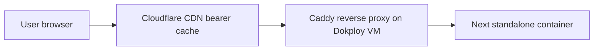

# deploy-target

## Decision

Dokploy VM (operator's existing infrastructure) hosts:
- Next.js standalone output (static client app)
- Caddy reverse proxy with cache module

Cloudflare provides DNS + edge cache (bearer-mode, stateless, public-immutable content only).

## Topology

## Why

- Operator-existing dokploy VM satisfies `book/PHILOSOPHY.md` "Seamless machine migration" + "Single bootstrap path globally" — reuses operator's already-proven deploy pattern (precedent in agent memory).
- Cloudflare CDN as bearer-mode cache is allowed per `book/PHILOSOPHY.md` "Self-host first" rule, because CDN is stateless edge — no persistent state at CF, swap = re-point DNS, cache rebuilds from origin in minutes.
- Caddy gives self-host TLS + caching independent of CF; if CF goes away the system still serves.

## Bootstrap

`tools/bootstrap-mac.sh`:
- Verifies bun, docker, dokploy CLI installed
- Reads operator-original credentials from single secrets root (per `book/HARD-RULES.md` "Single secrets root")
- Configures `.env` from secrets — `SITE_URL`, Cloudflare API token, optional Plausible + error-reporter values
- Runs `compose up` locally OR `dokploy deploy` against the operator's VM

Bootstrap is idempotent. Re-run on a green machine = no-op.

## Cloudflare bearer usage rules

Allowed:
- DNS proxy (CNAME + A records)
- CDN cache for content-addressed immutable paths (static assets, app bundles)
- TLS termination at edge

Banned:
- Cloudflare Workers (vendor-managed compute, `book/PHILOSOPHY.md` "Banned: provider-managed primitives without a self-hostable equivalent")
- Cloudflare KV, D1, R2 Worker bindings, Pages Functions, Durable Objects
- `CF-`-prefixed cache tags or any vendor-locked feature
- Persisting any visitor identifier at Cloudflare

## Verifier targets

- `make verify.local` — pure self-host stack green (no CF, direct VM IP)
- `make verify.bearer` — with CF in front, green
- `make verify.fresh` — bootstrap-from-zero pass

All three exercised periodically.

## Caught by

- `tools/lint/cloudflare-bearer.ts` greps for Worker/KV/D1 imports or `cf:`-shape config; zero hits required.
- Deploy smoke test asserts both paths serve identical responses (modulo cache-hit-ratio).
- `make verify.fresh` periodic ratchet per `book/PHILOSOPHY.md` "Seamless machine migration".
