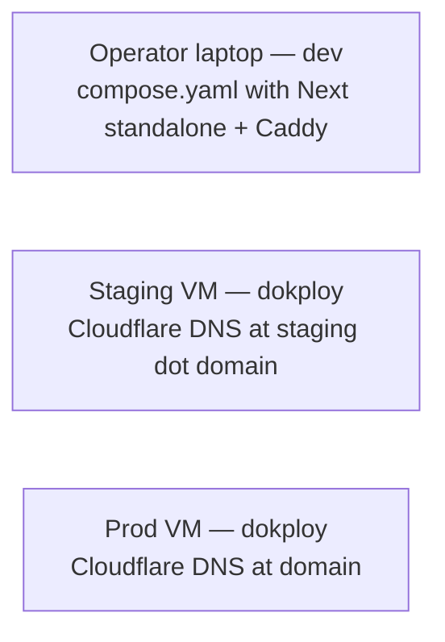
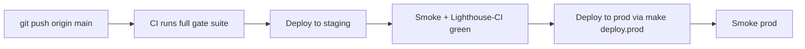

# multi-env

## Decision

Three deployment environments: `dev` (operator's laptop compose stack), `staging` (live VM, smoke + Lighthouse-CI target), `prod` (live VM, user-facing).

Each environment runs the identical stack (per `book/PHILOSOPHY.md` local-first-hostability invariant). Only env values, scale, and DNS differ.

## Topology

## Per-environment differences

| Aspect | dev | staging | prod |
|---|---|---|---|
| Domain | `localhost:3000` | `staging.<domain>` | `<domain>` |
| Plausible | local self-host or disabled | tracking on, separate site | tracking on |
| Error reporter | disabled | enabled if landed | enabled if landed |
| Cache TTLs | minimum (live editing) | production TTLs | production TTLs |
| Logs | verbose, stdout | structured JSON to log pipeline | structured JSON to log pipeline |

## Env variable shape

Per environment loaded from operator's secrets root:
- `<secrets-root>/sim/env.dev.env`
- `<secrets-root>/sim/env.staging.env`
- `<secrets-root>/sim/env.prod.env`

Bootstrap selects via `ENV=<env-name> sh tools/bootstrap-mac.sh`.

## Deploy flow

Prod deploy never bypasses staging green.

## Promotion

Staging → prod promotion: `make deploy.prod` which re-tags the staging-tested image and applies the same compose+helm values to prod. No rebuild in prod path.

## Banned

- "Quick fix in prod" deploys that skip staging
- Shared secrets across environments

## Caught by

- CI gate: prod deploy requires staging-green tag
- Env-name lint asserts every deployed env reads its own env file
- Smoke per environment after every deploy
