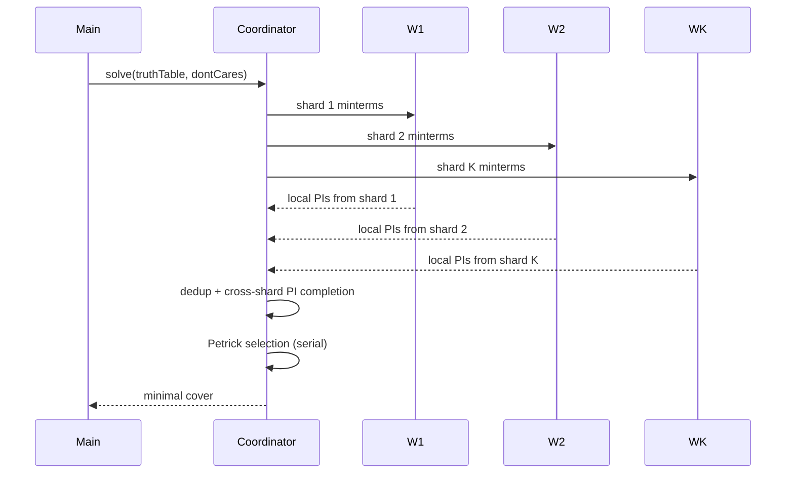

# parallel-solver

## Decision

Quine-McCluskey + Espresso solvers parallelize via truth-table partitioning. Coordinator merges. Net speedup ~0.7K for K workers.

## Why partition

QM finds prime implicants by combining adjacent minterms. The combine phase is data-parallel — each shard can find local PIs independently. Petrick selection (choosing minimum cover from PIs) is dependency-heavy and must merge sequentially.

For 6-variable functions (64 minterms), single-worker QM completes in ~50ms. Partitioned across 4 workers: combine phase ~15ms, merge + Petrick ~10ms = 25ms. ~2x speedup. For 12-var (Espresso, 4096 minterms), partition speedup approaches K.

## Architecture

## Partition strategy

Shard by minterm index modulo K. Each shard gets ~1/K of the minterms. Cross-shard adjacency (minterm in shard 1 combinable with minterm in shard 2) handled in the merge step.

For very large truth tables (>1024 minterms), partition by high-order variable bits — preserves spatial locality, reduces cross-shard adjacency surface.

## Worker pool

`min(navigator.hardwareConcurrency - 1, 4)` solver workers. Floor 2 (single-core devices still benefit from main-thread offload, though no partition speedup).

Pre-warmed at app boot per `PERFORMANCE.md`.

## Coordinator

Runs on a designated "coordinator" worker — same code as solver worker but switched into coordinator role for the request. Avoids main-thread for the merge + Petrick phase.

Alternative considered: coordinator on main thread. Rejected — Petrick selection can take 5-10ms on large functions; that's main-thread blocking budget we'd rather not spend.

## Cancellation

Solve request cancellable via `AbortSignal`. Cancel propagates to all workers via `postMessage`. Workers check `signal` between minterm combinations, return early.

## Result caching

Coordinator emits result hash (blake3 of truth-table + don't-cares input). Server-side `'use cache'` keys results by this hash. Re-solve with same input = cache hit, zero work.

`SharedWorker`-routed cross-tab: solver workers spawned by SharedWorker, cache hit serves any tab.

## Caught by

- Parallel solver smoke: 6-var function distributes across K workers, completes within budget
- Single-worker correctness fallback: K=1 produces identical result to K=4
- Cancellation smoke: AbortSignal mid-solve returns early, no zombie workers
- Cross-tab cache smoke: tab A solves 5-var, tab B requests same → cache hit
